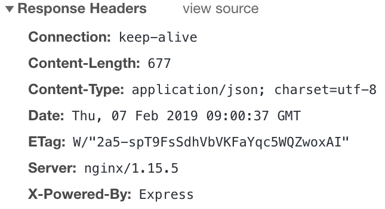
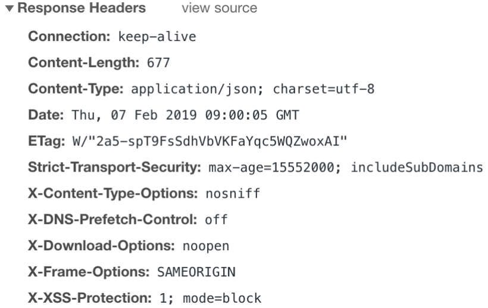

# Security Express

## Helmet 사용

helmet은 다양한 http 헤더를 설정하여 Express 앱을 보호하는데 도움이 된다.  
[npm helmet](https://www.npmjs.com/package/helmet)

```javascript
import helmet from "helmet";

// ...

aoo.use(helmet());
```

위 코드는 다음과 같다.

```javascript
import helmet from "helmet";

// ...

app.use(helmet.contentSecurityPolicy()); // [1]
app.use(helmet.crossOriginEmbedderPolicy());
app.use(helmet.crossOriginOpenerPolicy());
app.use(helmet.crossOriginResourcePolicy());
app.use(helmet.dnsPrefetchControl());
app.use(helmet.expectCt());
app.use(helmet.hidePoweredBy()); // [2]
app.use(helmet.hsts()); // [3]
app.use(helmet.ieNoOpen()); // [4]
app.use(helmet.noSniff()); // [5]
app.use(helmet.frameguard()); // [6]
app.use(helmet.originAgentCluster());
app.use(helmet.permittedCrossDomainPolicies());
app.use(helmet.referrerPolicy());
app.use(helmet.xssFilter());
[7];
```

### **_[1] Content-Security-Policy_**

##### **_app.use(helmet.contentSecurityPolicy());_**

브라우저에서 사용하는 컨텐츠 기반의 보안 정책으로 XSS나 Data Injection, Click Jacking등 웹 페이지에 악성 스크립트를 삽입하는 공격기법들을 막기 위해 사용.

### **_[2] hidePoweredBy_**

##### **_app.use(helmet.hidePoweredBy());_**

헤더에 노출되는 서버 정보를 제거하기 위해 X-Powered-By를 사용한다.

> **Helmet 미적용**
>
> 

> **Helmet 적용**
>
> 

또는 다음과 같이 어플리케이션이 PHP를 사용하지 않더라도 X-Powered-By 헤더가 그렇게 보이도록 설정할 수 있다.

> app.use(helmet.hidePoweredBy({ setTo: 'PHP 4.2.0' }));

### **_[3] hsts_**

##### **_app.use(helmet.hsts());_**

HTTP Strict Transport Security  
보안을 강화시킬 목적으로 웹사이트에 접속할 때 강제적으로 HTTPS Protocol로만 접속하게 하는 기능이다.

> HTTPS(Hypertext Transfer Protocol Secure) Protocol이란, Web Browser와 Web Server 간에 “암호 통신(SSL/TLS 통신)”을 수행하여, 통신 도중에 정보가 제3자에게 노출이 되지 않도록 하는 통신 Protocol입니다. 즉 HTTP(Hypertext Transfer Protocol) 통신 내용을 SSL/TLS 방식으로 암호화시켜 통신하는 Protocol입니다.

[more...](https://m.blog.naver.com/PostView.naver?isHttpsRedirect=true&blogId=aepkoreanet&logNo=221575708943)

### **_[4] IeNoOpen_**

##### **_app.use(helmet.ieNoOpen());_**

IE8 이후 버전에서 X-Download-Options를 설정한다. 이 옵션은 IE8 버전 이상의 인터넷 익스플로러에서 다운로드된 것들을 바로 여는대신 저장을 하게 하는 옵션이다. 사용자는 다운로드 파일을 먼저 저장하고 다른 응용프로그램에서 열어야 한다.

### **_[5] noSniff_**

##### **_app.use(helmet.noSniff());_**

X-Content-Type-Options 를 설정하여 선언된 콘텐츠 유형으로부터 벗어난 응답에 대한 브라우저의 MIME 스니핑을 방지한다. MIME이란 Multipurpose Internet Mail Extensions의 약자로 클라이언트에게 전송된 문서의 다양성을 알려주기 위한 포맷이다. 브라우저는 리소스를 내려받을 때 MIME 타입을 보고 동작하기에 정확한 설정이 중요하다.

MIME 스니핑이란 브라우저가 특정 파일을 읽을 때 파일의 실제 내용과 Content-Type에 설정된 내용이 다르면 파일로 부터 형식을 추측하여 실행하는 것인데, 편리함을 위한 기능이지만 공격자에게 악용 될 가능성이 있다.

### **_[6] frameguard_**

##### **_app.use(helmet.frameguard());_**

X-Frame-Options 헤더를 설정하여 클릭재킹에 대한 보호를 제공한다.  
클릭재킹이란 사용자가 자신이 클릭하고 있다고 인지하는 것과 다른 것을 클릭하도록 하여 속이는 해킹 기법이다. 속이기 위해 보이지 않는 레이어에 보이지 않는 버튼을 만드는 방법이 있다.

### **_[7] xssFilter_**

##### **_app.use(helmet.xssFilter());_**

X-XSS-Protection을 설정하여 대부분의 최신 웹 브라우저에서 XSS(Cross-site scripting) 필터를 사용하도록 한다.

[XSS 공격이란](https://overcome-the-limits.tistory.com/510)

---

## 어플리케이션 보안

### **_비동기 코드_**

비동기 콜백 함수는 Node.js의 강력한 기능 중 하나이지만 중첩 레이어를 늘리면 콜백지옥(Callback Hell)을 겪게 된다. 콜백지옥을 벗어나기위해 다음과 같이 async/await 형태의 코드로 변환하고 예외처리를 하도록 한다.  
또는 [프라미스 체이닝](https://ko.javascript.info/promise-chaining)을 사용한다.

```javascript
---
const func1 = async (name: string) => {
  console.log('func1:', name);
}

const func2 = async (name: string) => {
  console.log('func2:', name);
}

const func3 = async (name: string) => {
  console.log('func3:', name);
}

const func4 = async (name: string) => {
  console.log('func4:', name);
}

(async() => {
  try {
    let res1 = await func1("input1");
    let res2 = await func2("input2");
    let res3 = await func3("input3");
    let res4 = await func4("input4");
  } catch(err: any) {
    console.log(err);
  }
})();
---
```

### **_요청 크기 제한 설정 Set request size limits_**

요청 크기에 제한이 없는 경우, 공격자는 서버 메모리를 고갈시키거나 디스크 공간을 채울 수 있는 큰 요청 본문을 사용하여 요청을 보낼 수 있다. [raw-body 패키지](https://www.npmjs.com/package/raw-body)를 사용하여 모든 요청에 대한 요청 본문 크기를 제한할 수 있다.

```javascript
---
const contentType = require("content-type");
const express = require("express");
const getRawBody = require("raw-body");

const app = express();

app.use(function (req, res, next) {
  if (!["POST", "PUT", "DELETE"].includes(req.method)) {
    next();
	return;
  }

  getRawBody(
    req,
    {
      length: req.headers["content-length"],
      limit: "1kb",
      encoding: contentType.parse(req).parameters.charset,
    },
    function (err, string) {
      if (err) return next(err);
      req.text = string;
      next();
    }
  );
});
---
```

그러나 파일을 업로드할 때와 같이 일부 요청에는 요청 본문에 큰 페이로드가 있을 수 있으므로, 모든 요청에 대한 요청 크기 제한을 수정하는 것을 올바른 동작이 아니다. 또한 JSON을 구문 분석하는 작업은 차단 작업이기 때문에 JSON 유형을 사용하는 입력은 다중 부분 입력보다 더 위험하다. 따라서 다양한 내용 유형에 대한 요청 크기 제한을 설정해야 한다.  
다음과 같은 Express 미들웨어를 사용하면 매우 쉽게 이 작업을 수행할 수 있다.

```javascript
---
app.use(express.urlencoded({ extended: true, limit: "1kb" }));
app.use(express.json({ limit: "1kb" }));
---
```

공격자는 요청의 Content-Type 헤더를 변경하고, 요청 크기 제한을 무시할 수 있다. 따라서 요청을 처리하기 전에 요청에 포함된 데이터가 요청 헤더에 명시된 유형에 대해 검증되어야 한다.  
각 요청에 대한 내용 유형 유효성 검사가 성능에 심각한 영향을 미치는 경우 특정 내용 유형 또는 미리 결정된 크기보다 큰 요청만 유효성 검사를 할 수 있다.

---

## 기타 읽어보기

[홈페이지 취약점 분석 이야기](https://webhack.dynu.net/?idx=20161120.001)
